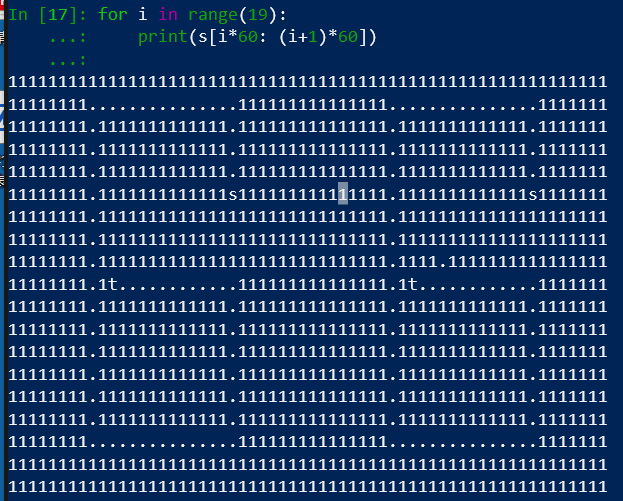

愣是没看懂一堆莫名其妙的变量跑哪去了

## `main()`  
.png)

## `check()`  
.png)

## `Setmap()`
```c++
__int64 __fastcall Setmap(char a1)
{
  __int64 result; // rax
  char v2; // [rsp+30h] [rbp-480h]
  unsigned __int64 v3; // [rsp+4A8h] [rbp-8h]
  __int64 savedregs; // [rsp+4B0h] [rbp+0h]

  v3 = __readfsqword(0x28u);
  qmemcpy(
    &v2,
    "11111111111111111111111111111111111111111111111111111111111111111111...............111111111111111...............111"
    "111111111111.1111111111111.111111111111111.1111111111111.111111111111111.1111111111111.111111111111111.1111111111111"
    ".111111111111111.1111111111111.111111111111111.1111111111111.111111111111111.1111111111111s111111111111111.111111111"
    "1111s111111111111111.11111111111111111111111111111.11111111111111111111111111111.11111111111111111111111111111.11111"
    "111111111111111111111111.11111111111111111111111111111.1111.111111111111111111111111.1t............111111111111111.1"
    "t............111111111111111.1111111111111.111111111111111.1111111111111.111111111111111.1111111111111.1111111111111"
    "11.1111111111111.111111111111111.1111111111111.111111111111111.1111111111111.111111111111111.1111111111111.111111111"
    "111111.1111111111111.111111111111111.1111111111111.111111111111111.1111111111111.111111111111111.1111111111111.11111"
    "1111111111.1111111111111.111111111111111...............111111111111111...............1111111111111111111111111111111"
    "111111111111111111111111111111111111111111111111111111111111111111111111111111111111111111111111",
    0x474uLL);
  if ( a1 == 'd' )
  {
    if ( y_2973 > 17 )
      result = 0LL;
    else
      result = *((unsigned __int8 *)&savedregs + 60 * y_2973 + ++x_2974 - 1152);
  }
  else if ( a1 > 'd' )
  {
    if ( a1 == 's' )
    {
      if ( x_2974 > 58 )
        result = 0LL;
      else
        result = *((unsigned __int8 *)&savedregs + 60 * ++y_2973 + x_2974 - 1152);
    }
    else
    {
      if ( a1 != 'w' )
        return 0LL;
      if ( y_2973 <= 0 )
        result = 0LL;
      else
        result = *((unsigned __int8 *)&savedregs + 60 * --y_2973 + x_2974 - 1152);
    }
  }
  else
  {
    if ( a1 != 'a' )
      return 0LL;
    if ( x_2974 <= 0 )
      result = 0LL;
    else
      result = *((unsigned __int8 *)&savedregs + 60 * y_2973 + --x_2974 - 1152);
  }
  return result;
}
```


查了一下这个题，原来是走迷宫的。在`Setmap()`里那堆字符串为地图，在ida里面倒是没直接看出来是长什么样子。  
注意到数字60，推断地图宽度为60，高19行。

所以flag就是`wwwwaaaaaaaaaaaaaasssssssssssssssddddddddddddddwwwwwwwaaaaaaaaaaaa`

具体过程**可能**以后再说吧，还没完全看懂